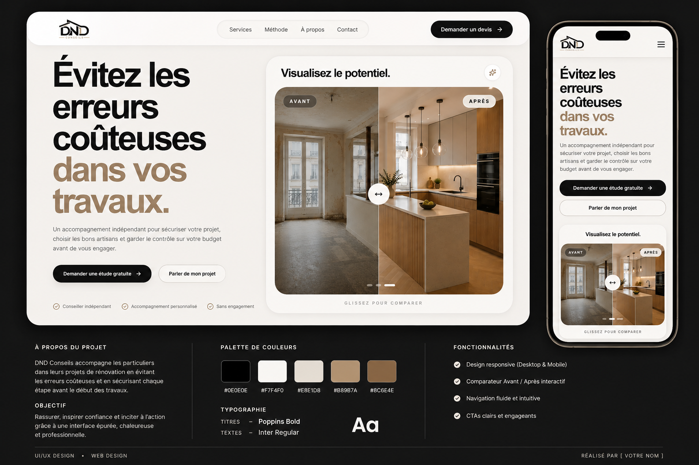

# 🏗️ DND Conseils — Premium Web Experience

## ✨ Overview

**DND Conseils** is a premium landing page designed for a construction and renovation consulting service.

The goal is simple:  
👉 **Build trust, educate users, and convert high-quality leads** before they commit to costly construction projects.

The interface combines:
- Modern editorial design  
- Smooth animations  
- Conversion-focused UX  
- Elegant and professional visual identity  

---

## 🚀 Live Demo

👉 https://dnd-conseils.vercel.app/

---

## 🎯 Project Goals

This project was designed to:

- Help users avoid costly mistakes in construction projects  
- Position the service as an independent expert  
- Generate qualified leads (quotes / contact requests)  
- Create a sense of clarity, trust, and control  

---

## 🧠 UX Concept

The UX strategy is built around 3 core principles:

### 1. Instant clarity
A strong hero section with a direct message:

> “Avoid costly mistakes in your construction projects.”

---

### 2. Visual proof
An interactive **Before / After** comparison:

- Reinforces credibility  
- Demonstrates real transformation  
- Increases engagement  

---

### 3. Progressive conversion
Multiple CTAs based on user intent:

- Free study  
- First consultation  
- Advanced project request  

---

## 🧩 Features

- ⚡ Smooth animations powered by Framer Motion  
- 📱 Fully responsive design  
- 🎨 Premium agency-level UI  
- 🔄 Interactive Before / After slider  
- 🧭 Clean and intuitive navigation  
- 📩 Lead generation system (quote requests)  
- 🧱 Scalable architecture  

---

## 🛠️ Tech Stack

- **Framework:** Next.js 16 (App Router)  
- **Styling:** Tailwind CSS  
- **Animations:** Framer Motion  
- **Icons:** Lucide React  
- **Deployment:** Vercel  

---

---

## 🎨 Design System

### Colors

- Background: `#F6F2EE`  
- Primary: `#0B0B0B`  
- Accent: `#B49A7C`  

### Typography

- Headings: **Poppins**  
- Body: **Inter**  

---

## 📸 Screenshots

/public/screenshots/mockup.png

